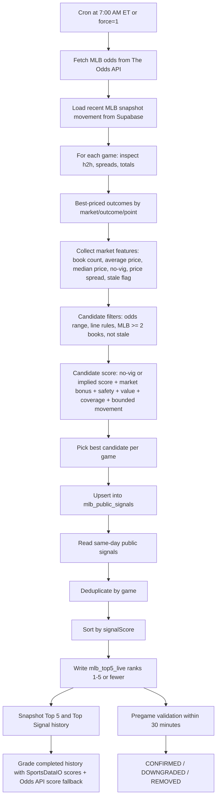

# MLB Engine Deep Review

Date: 2026-07-10

Status: engineering review only. No formulas, thresholds, prediction logic, production code, deployments, or commits were changed for this report.

## 1. Current Data Sources

### The Odds API

Purpose:

- Primary live market source for MLB automated picks.
- Provides event IDs, teams, start times, bookmakers, markets, outcomes, prices, and points.
- Provides completed score fallback for grading.

Where it enters:

- Pick generation: `app/api/cron/automationUtils.ts` via `fetchOdds(config.oddsKeys)`.
- MLB key: `baseball_mlb`.
- Markets requested: `h2h`, `spreads`, `totals`.
- Snapshot capture: `lib/market-impact/providers/oddsProvider.ts`.
- Completed scores: `app/api/cron/historyUtils.ts`.

Influence:

- Very high. The current MLB engine is market-derived. Odds determine candidate availability, pricing, implied probability, no-vig consensus, price shopping context, movement, closing validation, and much of ranking.

### Supabase Public Signal Tables

Purpose:

- Persist the daily candidate selected for each MLB game.

Where it enters:

- `mlb_public_signals` is written by `generatePublicSignalsForSport`.
- It is read by `generateDailyTop5ForSport`.
- It is also read by the Precision Engine candidate pipeline.

Influence:

- High. This table is the bridge between raw odds ingestion and public Top 5/precision products.

### Supabase Live Top 5 Tables

Purpose:

- Store the ranked daily Top 5 product rows.

Where it enters:

- `mlb_top5_live` is written by `generateDailyTop5ForSport`.
- It is read by history snapshot functions and pregame validation.

Influence:

- High for publication, closing status, history, and product display.

### Supabase Market Odds Snapshots

Purpose:

- Store bookmaker-level odds snapshots for MLB market movement detection.

Where it enters:

- Table: `public.market_odds_snapshots`.
- Snapshot write/read logic: `lib/market-impact/odds/snapshotRepository.ts`.
- Movement provider: `lib/market-impact/providers/oddsProvider.ts`.
- MLB engine feature map: `app/lib/mlb-engine/marketFeatures.ts`.

Influence:

- Medium today. Snapshot-derived movement can add bounded scoring context to MLB candidates, but missing movement does not penalize a candidate and single-book low-impact movement does not add score.

### Odds Movement Engine

Purpose:

- Compare previous and current snapshots.
- Detect moneyline price movement, spread/run-line point movement, total movement, and juice-only movement when thresholds are met.

Where it enters:

- `calculateOddsMovement`.
- `buildConsensusMovement`.
- `buildConsensusMovementFromSnapshots`.

Influence:

- Medium. It helps identify whether the market is reacting broadly, but it is not a true predictive model by itself.

### Market Impact / Atlas Event Engine

Purpose:

- Convert relevant news and odds movement into Market Impact events.
- Display market-moving context in the Impact page.

Where it enters:

- `/api/market-impact/news`.
- `lib/market-impact/eventEngine.ts`.
- `lib/market-impact/providers/gnewsProvider.ts`.
- `lib/market-impact/providers/oddsProvider.ts`.

Influence:

- Low on picks today. Market Impact is mostly informational. Odds movement from snapshots is used by MLB candidate scoring, but GNews/Atlas Events do not directly boost or downgrade picks.

### GNews

Purpose:

- Provides live MLB news for Market Impact cards.
- Filters out recaps, opinions, promos, rankings, fantasy-type noise, merchandise, tickets, and non-market content.

Where it enters:

- `lib/market-impact/providers/gnewsProvider.ts`.
- `lib/market-impact/normalizeGNewsArticle.ts`.
- `/api/market-impact/news`.

Influence:

- Low on prediction. GNews affects Market Impact UI, not the MLB pick score.

### Closing Status

Purpose:

- Validate Top 5 picks shortly before game start.
- Mark picks as `CONFIRMED`, `DOWNGRADED`, or `REMOVED`.

Where it enters:

- `validatePregameTop5ForSport` in `app/api/cron/automationUtils.ts`.
- Route: `/api/cron/validate-top5-pregame`.

Influence:

- Medium risk-control influence. It does not choose the original pick, but it can downgrade/remove stale or materially changed picks.

### Historical Picks and Grading

Purpose:

- Snapshot Top 5 and Top Signal to history tables.
- Grade completed picks as `WON`, `LOST`, `PUSH`, or `PENDING`.

Where it enters:

- `snapshotTop5`, `snapshotTopSignal`, and `gradePendingHistory` in `app/api/cron/historyUtils.ts`.
- Routes: `/api/cron/grade-mlb-top5`, `/api/cron/grade-mlb-top-signals`.

Influence:

- Low on current pick selection. History records outcomes but is not currently fed back into model training or ranking.

### SportsDataIO

Purpose today:

- Used only as a completed-score source when `isSportsDataIoSport(sport)` permits it.

Influence today:

- Low for prediction. It is not currently feeding MLB pitcher, lineup, injury, player, bullpen, weather, or matchup features into the automated pick engine.

### Data Not Available to the Prediction Engine Today

- Confirmed starting pitchers.
- Official lineups.
- Official player status/injuries.
- Bullpen usage/fatigue.
- Weather and park-specific wind.
- Umpire data.
- Structured roster moves.
- Team rolling offensive/defensive stats.
- Player-level projections.
- Play-by-play features.
- Betting splits/tickets/handle.
- First 5 innings lines.
- Team totals.
- Player props.
- Live betting.

## 2. Prediction Pipeline

Detailed behavior:

- Morning pool: generated by `/api/cron/generate-public-signals` or `/api/cron/generate-daily-top5`. Both skip unless the ET hour is 7, unless `force=1`.
- Candidate generation: each game can produce many market candidates, but only one public candidate per game survives.
- Top 5: generated from saved public rows, not directly from raw odds.
- Top Signal: in the Top 5 live table, rank 1 is marked `is_top_signal`. Separately, the Precision Engine has its own paid Top Signal/Top Play snapshot flow.
- Closing: within 30 minutes of start, a missing game/outcome becomes `REMOVED`; a line move of at least 1 point or a price deterioration of 35 cents or more becomes `DOWNGRADED`; otherwise `CONFIRMED`.
- Grading: moneyline, run line/spread, totals, draw/tie, win/loss/push are inferred from final scores and pick text.

## 3. Current Strengths

### Good Market Coverage for Core Full-Game MLB Markets

The engine supports MLB moneyline, run line, and totals. These are the most liquid everyday MLB markets and are appropriate before adding player/team specialty feeds.

### No-Vig Consensus

For valid two-sided markets, the engine removes bookmaker hold and uses median no-vig probability. That is materially better than raw American odds because it reduces sportsbook margin distortion.

### Book Coverage Filter

MLB candidates require at least two books. This avoids publishing a pick that exists only on one book or one malformed feed row.

### Price Shopping Awareness

The engine chooses the best observed price and records average price, median price, worst price, and spread. This is valuable because baseball edges are often small and price quality matters.

### Snapshot-Based Movement

The engine does not invent movement. It only builds movement context from stored snapshots. First snapshots create no movement, duplicate/no-change snapshots create no movement, and consensus is based on real sportsbook count.

### Bounded Movement Influence

Movement can help scoring, but single-book low-impact movement contributes nothing. This prevents one-book noise from becoming a fake signal.

### Abstention

The Top 5 process slices to five but does not force five if fewer qualified rows exist. That is an important risk-control property.

### Deduplication

Top 5 dedupes by game. This avoids publishing multiple correlated picks from the same matchup in the same Top 5.

### Closing Validation

The pregame validator detects removed outcomes, large line movement, and major price deterioration. It is simple, but it protects against obvious stale picks.

### Modular Architecture

Market features, odds movement, snapshots, Market Impact, candidate pool, precision scoring, and grading are separated well enough to support SportsDataIO integration without rewriting the entire app.

## 4. Current Weaknesses

### No Confirmed Starting Pitchers

MLB moneylines and totals are heavily pitcher-dependent. Without confirmed starters, the engine cannot distinguish a normal market move from a pitcher scratch, opener, bullpen game, or mismatch.

Effect: large prediction-quality ceiling on moneyline, totals, and run line.

### No Official Lineups

The engine cannot know if star hitters are resting, if platoon splits changed, or if a lineup is significantly weaker than expected.

Effect: weak late-day accuracy, especially for totals and team-side markets.

### No Structured Injuries or Player Status

GNews may surface articles, but those events do not directly score picks. There is no structured player availability input.

Effect: market information may be visible to users but not converted into model features.

### No Bullpen Data

The engine cannot evaluate reliever fatigue, recent workload, closer availability, or bullpen quality.

Effect: weak full-game totals, run line, and late-game moneyline assessment.

### No Weather

No wind, temperature, humidity, precipitation, roof, or park-condition input is in the pick score.

Effect: totals are market-derived only. The engine can follow totals movement but cannot independently understand why a total should move.

### No Umpire Data

Strike-zone tendencies are absent.

Effect: small to medium limitation for totals and pitcher-sensitive markets.

### No Team or Player Rolling Stats

There is no structured offensive form, handedness split, defensive quality, baserunning, starter profile, or recent matchup feature.

Effect: the engine cannot form its own projection. It reads markets, it does not independently beat them yet.

### No Betting Splits

No public bet count, handle, sharp book identification, or liability data exists.

Effect: reverse-line-movement style fields cannot be trusted as true sharp signals today.

### Confidence and Edge Are Labels from Score Bands

`confidence_label` and `edge_label` are generated from the internal score. They are not calibrated win probability, expected ROI, or model edge over fair price.

Effect: good for product language, weak for quant-grade decisioning.

### History Is Not a Training Loop

Historical picks are graded, but results do not feed back into weights, thresholds, calibration, or market-specific performance.

Effect: the engine cannot learn from its own errors yet.

## 5. Formula Review

### Candidate Score

What it measures:

- Market-implied strength through no-vig probability when available.
- Raw implied probability fallback.
- Market type preference.
- Price safety.
- Plus-money/value preference.
- Book coverage.
- Bounded consensus movement context.

Overlap:

- No-vig/implied probability, price safety, and value bonus all partially describe price. This creates overlap.
- Market bonus and movement bonus are separate.

Review:

- Useful as a ranking heuristic.
- Not yet a true predictive edge model because it lacks independent probability.

### Signal Score

What it measures:

- When a row has `internal_score`, `confidence`, `edge`, or `score`, it trusts that value.
- Otherwise it uses odds implied probability, market bonus, and value bonus.

Overlap:

- It can rank by stored score if present, otherwise by a simpler fallback that overlaps with candidate score but excludes no-vig, coverage, stale, and movement context.

Review:

- This is a pragmatic persistence fallback, not a robust scoring layer.

### Confidence

What it measures:

- For public signals: label bands from score: `High`, `Strong`, `Qualified`, `Monitored`.
- For Atlas Events: separate event confidence based on source reliability, provider count, agreement, market movement, and freshness.

Overlap:

- Public signal confidence overlaps with edge/value because it derives from the same candidate score.
- Event confidence is a different concept and should not be confused with pick confidence.

Review:

- Should eventually be redesigned into calibrated probability or tiered confidence based on backtesting.

### Edge

What it measures:

- Public `edge_label` is a text label from score bands.
- Candidate Pool `edge` is currently null unless inherited from raw rows.
- Precision `edge` can be used as source score but is not a true edge value today.

Overlap:

- Heavy overlap with confidence because both come from the same score.

Review:

- Needs redesign later. Today it should be interpreted as a product label, not expected value.

### Value Priority

What it measures:

- In Candidate Pool types, `valuePriority` exists but is not populated by the builder.
- Precision adapter can map `valuePriority` into `internalScore`, but current public signal source generally does not provide a true `valuePriority`.

Overlap:

- Conceptually overlaps with edge and score, but is mostly absent today.

Review:

- Placeholder architecture is present. Quant meaning is not.

### Consensus

What it measures:

- For odds movement: number of books moving the same event/market/outcome/direction divided by monitored book count.
- For no-vig: median fair probability samples across two-way market pairs.

Overlap:

- Movement consensus and no-vig consensus are different and useful. One measures directional change; the other estimates current fair market probability.

Review:

- This is one of the strongest current components.

### Movement

What it measures:

- H2H: implied probability/price direction as `SHORTENING` or `DRIFTING`.
- Spreads/totals: point direction first, then implied/juice direction.
- Impact: magnitude from implied delta, point delta, speed, and consensus.

Overlap:

- Movement can overlap with current price because a shortened price also changes implied probability.

Review:

- Good market scanner. It is not enough by itself to know whether the current price is still playable.

### Atlas Impact

What it measures:

- Event importance for Market Impact cards using category base score, impact level, source count, and publisher quality.

Overlap:

- It overlaps with Event Confidence for UI trust, but not with pick scoring.

Review:

- Good for news/event triage. It should remain separate from direct pick EV until structured matching exists.

## 6. Pick Quality Estimate

These are engineering estimates based on the current implementation, not backtested ROI.

| Category | Score | Reason |
| --- | ---: | --- |
| Market Reading | 72% | Good no-vig, price shopping, coverage, and movement handling. Still lacks sharp book weighting and betting splits. |
| Prediction Quality | 42% | Mostly market-derived. No independent MLB projection inputs yet. |
| Risk Control | 68% | Odds range, book minimum, stale rejection, dedupe, abstention, and closing validation are meaningful. |
| Data Quality | 55% | Odds data and snapshots are useful, but core MLB context is absent. |
| Ranking | 58% | Ranking is coherent as a heuristic but has overlapping price-derived terms and no backtested calibration. |
| Overall Engine | 56% | Production-useful as a market reader, not yet a mature quant prediction engine. |

## 7. SportsDataIO Impact

Estimated impact is approximate engineering judgment.

| Feed | Expected Improvement | Benefits |
| --- | ---: | --- |
| Starting Pitchers | +8% | Moneyline, totals, run line, pitcher-change detection, no-play rules. |
| Official Lineups | +7% | Hitter availability, lineup strength, platoon changes, late scratches. |
| Injuries / Player Status | +5% | Structured availability instead of news-only inference. |
| Bullpen Data | +5% | Full-game sides/totals, late-game risk, run line exposure. |
| Weather | +4% | Totals, park-adjusted scoring context, Wrigley/wind-type events. |
| Team Rolling Stats | +4% | Independent projection features beyond market price. |
| Player Stats / Splits | +4% | Handedness, starter-vs-lineup, lineup run projection. |
| Matchup Stats | +3% | Improves ranking and conflict detection. |
| Play by Play | +3% | Future form, bullpen usage, live/late grading enrichment. |
| Betting Splits | +3% to +6% | Public-vs-sharp context if source quality is strong. |
| Transactions / Roster Moves | +2% | Better context for unexpected lineup/team changes. |
| Umpire Data | +2% | Totals and strikeout-sensitive context. |

## 8. Future Priority List

1. Official starting pitchers.
2. Official lineups.
3. Structured injuries/player status.
4. Bullpen usage and availability.
5. Weather and park factors.
6. Team rolling offensive/defensive stats.
7. Player splits and projected lineup quality.
8. Betting splits/handle/ticket context.
9. Sharp book weighting.
10. Historical backtesting and score calibration.
11. Market-specific models for moneyline, totals, and run line.
12. Umpire data.
13. First 5 innings markets.
14. Team totals.
15. Player props.
16. Live market support.

## 9. Final Engine Score

| Category | Score | Explanation |
| --- | ---: | --- |
| Architecture | 78% | Modules are separated: odds, snapshots, movement, Market Impact, candidate pool, precision, grading. Good base for expansion. |
| Code Quality | 74% | TypeScript is mostly clear and testable. Some duplicated implied-probability logic remains in precision/candidate code. |
| Prediction Logic | 43% | Strong market heuristic, but not an independent MLB model yet. |
| Data Quality | 55% | Good odds/snapshot data; weak baseball-context data. |
| Scalability | 70% | Can add providers and features without full rewrite. Needs stronger typed domain models as complexity grows. |
| Maintainability | 72% | Current modules are understandable. Score semantics need clearer separation before more formulas are added. |
| Production Readiness | 68% | Ready for controlled production use as market-driven signals with risk controls. Not ready to claim fully predictive AI edge. |
| Overall | 62% | Solid pre-SportsDataIO foundation; limited by missing structured MLB inputs. |

## 10. Final Conclusion

### Is the engine production ready?

Yes, for a market-driven signal product with transparent risk controls. It can generate and publish MLB signals, validate them before start, snapshot history, grade results, and expose audit data.

No, if the standard is a fully mature predictive MLB quant model. It does not yet have the baseball-specific inputs required for that level.

### Can Atlas generate competitive MLB picks today?

Yes, moderately. It can read market structure, find better prices, avoid thin markets, use no-vig consensus, detect real movement, and avoid stale/invalid candidates. That is competitive with a basic market scanner.

It is not yet competitive with high-end MLB models that include starters, lineups, weather, injuries, bullpen state, projections, and splits.

### Biggest weakness

The engine does not have an independent baseball projection layer. It mostly interprets market prices and movement. Without pitchers, lineups, weather, injuries, bullpen, and team/player stats, it cannot know when the market is wrong versus simply efficient.

### Biggest strength

The strongest component is the market infrastructure: odds ingestion, no-vig consensus, book coverage, snapshot storage, movement detection, consensus movement, abstention, and closing validation. This is exactly the right foundation before adding richer data.

### If SportsDataIO never existed, how far could this engine realistically go?

It could become a strong market scanner, probably around 65-70% engineering maturity, by improving snapshot frequency, sharp book weighting, backtesting, price deterioration controls, and closing-line-value tracking.

It would still struggle to become a true MLB prediction engine because it would lack structured baseball causes behind the market.

### If SportsDataIO is integrated, how much better can it become?

Substantially better. With starters, lineups, injuries, bullpen state, weather, and structured player/team stats, Atlas can move from market-reading to projection-building. The realistic ceiling could move from roughly 56-62% overall today into the 75-85% range after disciplined integration, backtesting, and calibration.

